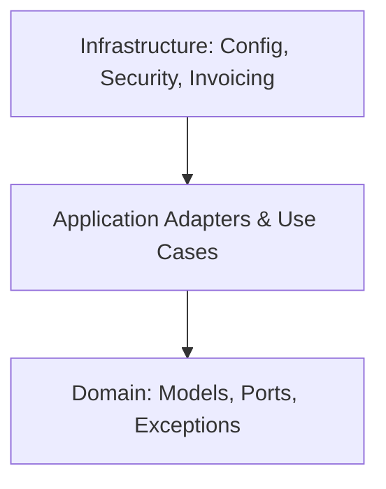

# Diseño de Arquitectura - Artesanías Chigorodo API

Este documento describe la estructura arquitectónica basada en **Arquitectura Hexagonal (Puertos y Adaptadores)** y **Domain-Driven Design (DDD)** implementada en la API de **Artesanías Chigorodo**, incorporando un modelo híbrido de bases de datos relacionales (SQL) y documentales (NoSQL).

---

## 1. Patrón Arquitectónico: Hexagonal (DDD) con Base de Datos Híbrida

El objetivo principal es aislar la lógica del negocio (Dominio) de cualquier framework, base de datos, librería externa o protocolo de transporte. Las dependencias siempre apuntan hacia adentro:

### Estrategia Híbrida SQL + NoSQL:
- **MySQL (Relacional - ACID):** Almacena datos transaccionales críticos de negocio: Usuarios (`User`), Órdenes (`Order`, `OrderItem`), Detalles de Envío (`ShippingDetails`), Detalles de Pago (`PaymentDetails`), y Facturación Electrónica (`Invoice`).
- **MongoDB (Documental - Lectura Rápida):** Almacena los productos (`Product`). Como el catálogo posee colecciones de imágenes, colores dinámicos y descripciones variables, MongoDB ofrece flexibilidad y rapidez de lectura.
- **Relación desacoplada:** Los ítems de un pedido (`OrderItemEntity` en MySQL) almacenan instantáneas planas del producto (`productId`, `productName`, `sellerId`, `sellerName`, `unitPrice`) en lugar de hacer llaves foráneas JPA físicas a MongoDB, asegurando la inmutabilidad histórica de la factura y desacoplando ambos sistemas.

---

## 2. Estructura de Paquetes (`com.artesaniaschigorodo`)

### A. Capa de Dominio (`domain`)
Contiene las reglas de negocio puras y es independiente de Spring Boot, Hibernate o cualquier otra tecnología.
- **`exceptions`:** Clases base y específicas de error de negocio (ej. `BusinessException`, `ResourceNotFoundException`).
- **`models` (Organizado en Subcarpetas por Dominio):** Entidades puras de Java agrupadas conceptualmente:
  - **`client`:** Contiene `User` (el usuario/cliente artesano o comprador).
  - **`product`:** Contiene `Product` (las artesanías).
  - **`order`:** Contiene `Order`, `OrderItem`, `ShippingDetails`, `PaymentDetails` e `Invoice` (los pedidos, envíos, pagos y facturas).
- **`models.enums`:** Enumeradores de negocio (`Role`, `Category`, `OrderStatus`, etc.).
- **`ports.in`:** Interfaces (casos de uso) que definen lo que la aplicación puede hacer desde la perspectiva del negocio (ej. `AuthUseCase`, `ProductUseCase`, `OrderUseCase`).
- **`ports.out`:** Interfaces (SPI) que definen lo que el dominio necesita del exterior (ej. `UserPersistencePort`, `ProductPersistencePort`, `OrderPersistencePort`, `InvoicePersistencePort`, `ElectronicInvoicingPort`, `PasswordEncoderPort`, `JwtTokenPort`).

### B. Capa de Aplicación (`application`)
Orquesta los flujos de datos e implementa la comunicación entre el exterior y el dominio.
- **`useCases`:** Implementaciones concretas de las interfaces de entrada (`ports.in`). Coordinan la lógica de negocio consumiendo los puertos de salida (`ports.out`).
- **`adapters.api`:** Controladores REST e interfaces web externas:
  - `controllers`: Endpoints `/api/auth`, `/api/products`, `/api/orders`, `/api/users`.
  - `request` / `response`: DTOs de entrada y salida aislados de las entidades físicas.
- **`adapters.persistence.sql` (MySQL Adapters):** Capa de acceso a datos MySQL para transacciones:
  - `entities`: Entidades JPA (ej. `UserEntity`, `InvoiceEntity`, `OrderItemEntity`).
  - `repositories`: Repositorios Spring Data JPA (`InvoiceJpaRepository`).
  - `mappers`: Convertidores manuales bidireccionales de dominio a JPA.
  - `adapters`: Implementaciones de salida de persistencia SQL (`InvoicePersistenceAdapter`, `OrderPersistenceAdapter`, `UserPersistenceAdapter`).
- **`adapters.persistence.mongodb` (MongoDB Adapters):** Capa de acceso a datos MongoDB para catálogo:
  - `documents`: Documentos Spring Data MongoDB (`ProductDocument`).
  - `repositories`: Repositorio Mongo (`ProductMongoRepository`).
  - `mappers`: Convertidor de dominio a MongoDB Document (`ProductMongoMapper`).
  - `adapters`: Implementación de salida de persistencia NoSQL (`ProductMongoPersistenceAdapter`).

### C. Capa de Infraestructura (`infrastructure`)
Configuraciones transversales y componentes tecnológicos de soporte.
- **`config`:** Manejador global de excepciones (`GlobalExceptionHandler`) y CORS (`WebMvcConfig`).
- **`security`:** Configuración de Spring Security (`SecurityConfig`), filtros JWT, y adaptadores de encriptación y tokens.
- **`invoicing`:** Implementación del puerto de facturación electrónica (`SimulatedElectronicInvoicingAdapter`), responsable de la generación del CUFE y simulación del estado ante la DIAN.

---

## 3. Flujo de una Solicitud REST (Caso Facturación)

1. **Checkout:** El cliente envía una solicitud de checkout. Si el pago es aprobado, se crea y guarda la orden en estado `PAID` en MySQL.
2. **Disparador:** El caso de uso `OrderUseCaseImpl` detecta la orden en estado `PAID` e invoca al puerto `ElectronicInvoicingPort.submitInvoice`.
3. **Simulación DIAN:** El adaptador de infraestructura `SimulatedElectronicInvoicingAdapter` computa un CUFE (SHA-256) a partir de los datos del pedido y crea un objeto `Invoice` marcado como `DIAN_APPROVED`.
4. **Persistencia:** La factura generada se guarda de manera persistente en base de datos MySQL mediante el puerto `InvoicePersistencePort`.
5. **Consulta:** El cliente puede recuperar esta factura de forma segura mediante el endpoint GET `/api/orders/{orderNumber}/invoice`.
